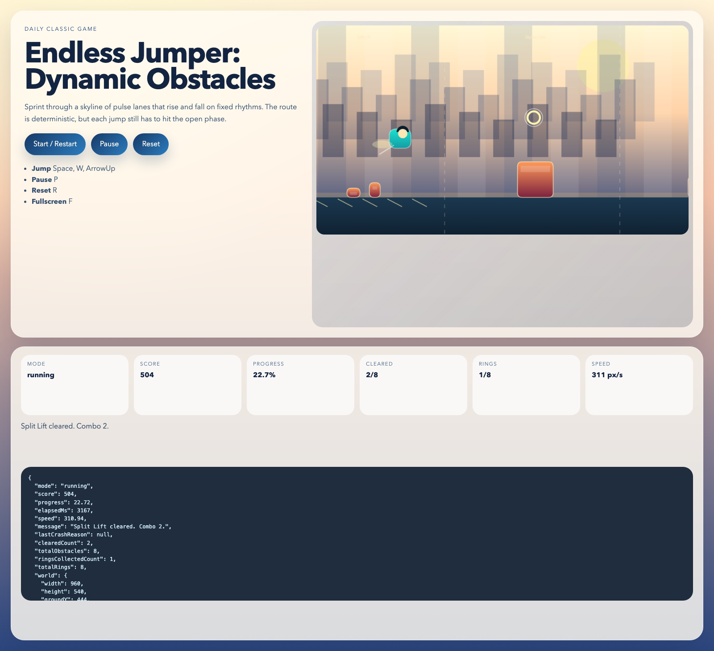
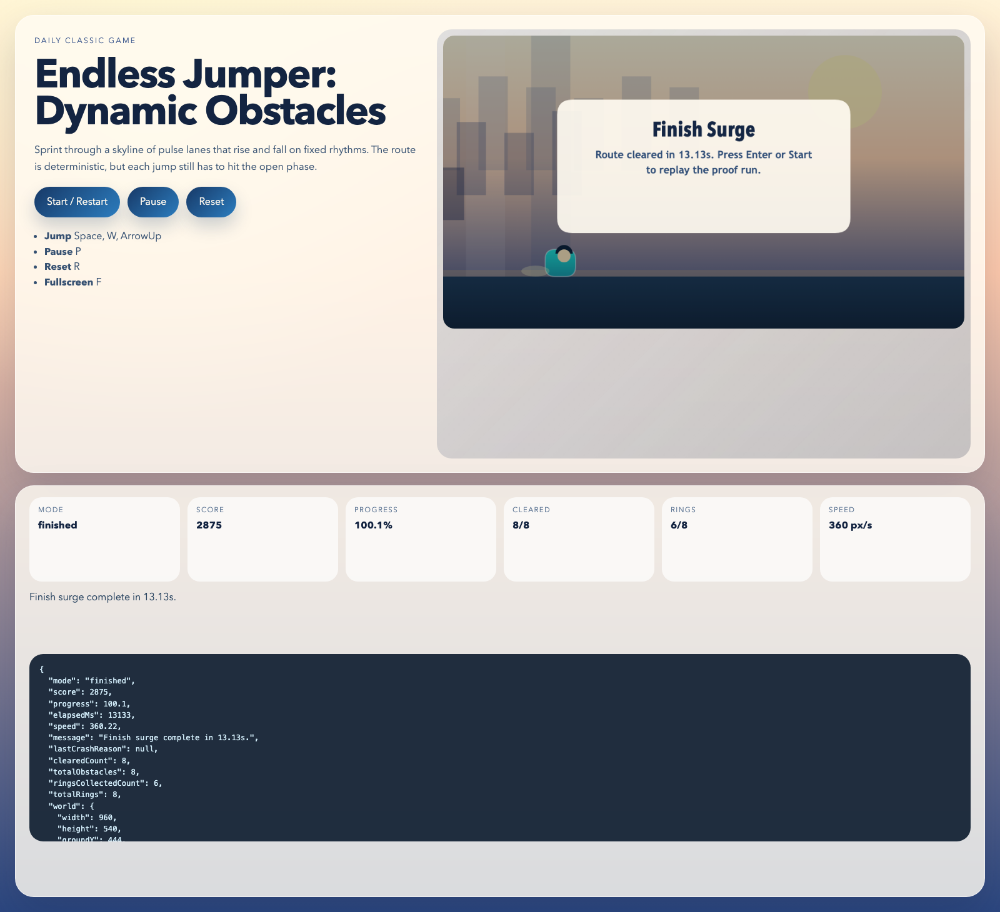

# daily-classic-game-2026-05-13-endless-jumper-dynamic-obstacles

<p align="center"><strong>Endless Jumper reimagined as a deterministic pulse-lane sprint where each obstacle swells and settles on a fixed rhythm, turning the classic endless-hop fantasy into a proof-friendly route with a clean finish state.</strong></p>

<p align="center">
  
  
</p>

## Quick Start

```bash
pnpm install
pnpm test
pnpm build
pnpm capture
pnpm dev
```

## How To Play

- Press `Enter` or click `Start / Restart` to begin the route.
- Press `Space`, `W`, or `ArrowUp` to jump.
- Press `P` or click `Pause` to freeze the timer and obstacle pulses.
- Press `R` or click `Reset` to return to the title state.
- Press `Enter` again after a wipeout or finish to replay the deterministic proof route.

## Rules

- The route contains eight named pulse-lane obstacles driven by deterministic timing cycles.
- Each obstacle stays dynamic on approach, then settles into a bounded crossing phase near the runner so the route remains readable and fair.
- Contact with any pulse segment ends the run immediately.
- Rings are optional score pickups; the verified proof route collects six of eight while prioritizing safe gate clears.
- The run finishes only after the full route distance is cleared and all eight gates are passed.

## Scoring

- Distance contributes a continuous base score as the route advances.
- Each ring grants `+120`.
- Each cleared gate grants a combo-scaled bonus.
- The finish bonus scales from completion time, ring count, and peak combo streak.
- The verified proof route finishes in `13.13s` with `8/8` gates, `6/8` rings, peak combo `8`, and a final score of `2875`.

## Twist

`Dynamic obstacles`

Every lane pulses between lower and higher clearance states on a visible beat. The route itself stays deterministic, but the moment-to-moment read is about spotting when each lane has settled into its safe phase instead of reacting to static blocks.

## Verification

- `pnpm test`
- `pnpm build`
- `pnpm capture`
- Browser hooks:
  `window.advanceTime(ms)` advances the deterministic simulation.
  `window.render_game_to_text()` returns the current route state as JSON text.
- Proof route summary:
  finish `13.13s`, score `2875`, `8/8` gates, `6/8` rings, peak combo `8`.
- Pause proof:
  `artifacts/playwright/state-3-paused.json` shows elapsed time, progress, and spatial state frozen between the `before` and `after` snapshots.
- Action payload:
  `artifacts/playwright/action_payload.json` uses the required `buttons`, `mouse_x`, `mouse_y`, and `frames` schema.
- Screenshots:
  `artifacts/playwright/shot-0-title-start.png`
  `artifacts/playwright/shot-1-opening-surge.png`
  `artifacts/playwright/shot-2-pulse-ladder.png`
  `artifacts/playwright/shot-3-paused.png`
  `artifacts/playwright/shot-4-finish-banner.png`
  `artifacts/playwright/shot-5-reset-title.png`

### GIF Captures

- `Opening surge`: `assets/gifs/clip-01-opening-surge.gif`
- `Pulse ladder`: `assets/gifs/clip-02-pulse-ladder.gif`
- `Finish banner`: `assets/gifs/clip-03-finish-banner.gif`

## Project Layout

```text
src/                 deterministic simulation, autopilot helper, and renderer
scripts/             self-check and Playwright capture entry points
tests/               Node-based route and pause assertions
artifacts/playwright/ screenshots, state dumps, action payload, and logs
assets/gifs/         exported GIF clips for the README
docs/plans/          run-local implementation plan
```
